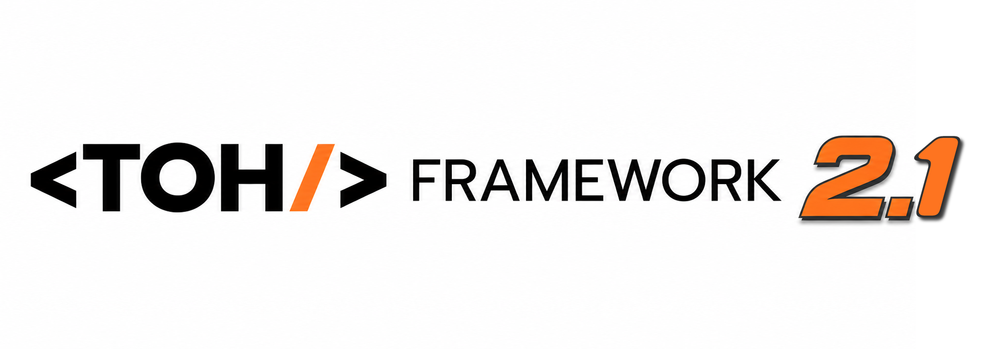

<p align="center">
  
</p>

<h3 align="center">"Type Once, Have it all!" — AI-Orchestration Driven Development</h3>

<p align="center">Approve once. Walk away. Come back to a finished, verified app.</p>

[](https://www.npmjs.com/package/toh-framework)
[](https://www.npmjs.com/package/toh-framework)
[](https://github.com/wasintoh/toh-framework/blob/main/LICENSE)
[](https://github.com/wasintoh/toh-framework)

**Toh Framework** installs an AI "build department" into your project: **14 slash commands, 8 specialist agents, and 23 skills** — configured for Claude Code, Cursor, Antigravity, Codex, and ZCode in one install. You type one sentence (like `/toh-vibe coffee shop management system`), approve once, and it plans, builds, tests, and fixes until the app is verified done.

```bash
npx toh-framework install
```

**If you don't write code:** you get one screen that asks for your idea in plain language and one "Go". No stack to choose, no config to fill in, no jargon to decode. The AI writes the plan as a checklist you can actually read, then works down it — building, running its own tests, fixing what breaks — and comes back when the thing is finished. If it gets stuck, it says which step and why, in a sentence.

**If you do write code:** it's a plan-as-file loop your agent cannot fake its way out of. The backlog lives in `.toh/plan.md` as checkboxes, so any session in any of the 6 supported IDEs resumes exactly where the last one stopped. The orchestrator re-runs each task's checkpoint itself and must quote real output before ticking the box — "done" means a command exited zero, not that a model said so. Model routing keeps cost sane (haiku scaffolds and tests, sonnet builds, opus plans and reviews), and everything is generated from one source of truth, so nothing drifts between IDEs.

Changed your mind? `npx toh-framework uninstall` shows you exactly what it will remove, keep, or edit — and asks first.

🌐 **Official Website:** [tohframework.dev](https://tohframework.dev)

> 📖 **[🇹🇭 Thai Documentation](docs/README-TH.md)**

## 🆕 What's New in v2.1.0

> **The compatibility release.** We tested every supported IDE against its current release — and fixed everything that had quietly broken. Same framework, now actually loaded everywhere.

| Feature | What it means for you |
|---------|----------------------|
| 🛰️ **Antigravity, first-class** | Antigravity and the Antigravity CLI (`agy`) are now a native target, not an afterthought: a full workspace `.agents/` surface with an Always-On rule, 14 workflows, 8 file-based subagents, every skill, and a deterministic Stop hook (`.agents/hooks.json`) that refuses to end a session while `.toh/plan.md` still has unchecked work. |
| 📦 **Codex — un-truncated** | Codex silently cuts project docs at 32 KB; our old AGENTS.md was 3.6× over, so 6 of 8 agents never loaded. The new AGENTS.md is a ~12.7 KB compact roster — everything fits, agents and commands are read from `.toh/` at runtime, and the installer hard-fails if the file ever outgrows the budget. It also writes a guarded `.codex/config.toml` that raises the doc limit (never overwriting yours). |
| 🤝 **One skills standard, four IDEs** | All 37 skills (23 framework skills + 14 `/toh-*` command skills) are written once into `.agents/skills/` — the open standard natively discovered by Codex, Cursor 2.4+, Antigravity, and ZCode. One write, four tools, zero drift. |
| 💠 **ZCode support, verified live** | ZCode (Z.ai) reads the same open surfaces, so it needs no bespoke files: `AGENTS.md` for project memory, `.agents/skills/` for all 37 skills, and `.agents/commands/` for 14 real `/toh-*` slash commands. Verified against ZCode CLI 0.16.3, not assumed — `zcode skills list` reports 37 project-scope skills and `zcode commands list` reports all 14 commands, both with zero diagnostics. |
| 🧩 **Cursor 2.4 native subagents** | Cursor now gets a real team: 8 Toh specialists installed as native subagents in `.cursor/agents/` that Cursor can delegate to (before, our rule told Cursor "no team here" — leaving free speed on the table). |
| ⚡ **Claude Code skills preload** | Subagents now start with their skills fully loaded via the native `skills` frontmatter key — no more hoping the model remembers to open the file. |
| 🧹 **`toh uninstall` — finally** | Until now, installing Toh Framework was a one-way door. Now `npx toh-framework uninstall` prints a plain-language preview of every file it would remove, keep, or edit, and asks once before touching anything. It only deletes what it can *prove* it installed (a sha256 record written at install time); a file you edited is kept and named on screen, shared files like `CLAUDE.md` are edited surgically instead of rewritten, and your plan, notes, and memory survive unless you opt in separately. `--dry-run` to look without touching. |

### Also in 2.1.0

- ⌨️ **Real slash shortcuts on Claude Code** — `/toh-v`, `/toh-p`, `/toh-pt` and friends are now registered command files, not just prose patterns. The old `/toh-p` collision is resolved: `/toh-p` = `/toh-plan`, `/toh-pt` = `/toh-protect` (also `/toh-security`, `/toh-audit`).
- 📇 **Live catalog** — `npx toh-framework list` now reads commands, agents, and skills straight from source, so its counts can never go stale again.
- 🧾 **Skill descriptions everywhere** — all 23 skills now carry real frontmatter descriptions, so every IDE's auto-invocation actually knows what each skill is for.
- 🏳️ **Legacy escape hatches, off by default** — `--legacy-gemini` keeps `.gemini/` output for Enterprise/GCP Gemini CLI users; `--legacy-cursorrules` writes the old root `.cursorrules` for very old Cursor versions.

## 🤖 Supported IDEs

| IDE | Status | Notes |
|-----|--------|-------|
| 🧠 **Claude Code** | ✅ Full Support | Native subagents + skills preload, Stop hook, slash commands & shortcuts |
| 📝 **Cursor (2.4+)** | ✅ Full Support | Native subagents (`.cursor/agents/`), skills via `.agents/skills/`, always-on rules |
| 🛰️ **Antigravity CLI (agy) + IDE** | ✅ Full Support | `.agents/` rules + skills + workflows + subagents + Stop hook |
| 🤖 **Codex** — CLI + Codex desktop app (ChatGPT app) | ✅ Supported | Compact AGENTS.md + repo-level skills |
| 💠 **ZCode (Z.ai)** | ✅ Supported | AGENTS.md + `.agents/skills/` + native `/toh-*` in `.agents/commands/` |
| 💎 **Gemini CLI** | 🏢 Legacy | Enterprise/GCP only, behind `--legacy-gemini` |

## 💡 Why Toh?

**Toh** = **T**ype **O**nce, **H**ave it all!

We believe **Solo Developers** and **Solopreneurs** should be able to build SaaS systems single-handedly without being an expert in every field.

Toh Framework enables you to:
- 💬 **Command in natural language** - No complex prompts needed
- 🤖 **AI handles everything** - Breaks down tasks, calls agents, executes until done
- 👀 **See results instantly** - No waiting, no answering questions
- 🚀 **Production-ready** - Not just a prototype

### 📜 Previous Versions

See [CHANGELOG.md](CHANGELOG.md) for complete version history.

**Recent highlights:**

| Version | Date | Key Feature |
|---------|------|-------------|
| v2.1.0 | 2026-08-16 | Compatibility release: agy support, Codex un-truncated, Cursor native subagents, shared `.agents/skills` |
| v2.0.0 | 2026-07-14 | One-Go Build, TOH LOOP, Design Identity, Auto-Resume |
| v1.8.0 | 2026-01-11 | 7-File Memory System, Agent Announcements |
| v1.7.0 | 2025-12-26 | Security Engineer, `/toh-protect` command |
| v1.6.0 | 2025-12-18 | Claude Code Sub-Agents, Multi-Agent Orchestration |
| v1.5.0 | 2025-12-05 | Google Antigravity/Gemini Support |

---

## ✨ Features

| Feature | Description |
|---------|-------------|
| **One-Go Build** | `/toh-plan` → approve once → whole app built autonomously |
| **TOH LOOP** | Builds, tests, and fixes itself until every task is verified DONE |
| **`/toh` Smart Command** | Type anything, AI picks the right agents and models |
| **Design Identity** | Per-project `DESIGN.md` + versioned AVOID-LIST — no "AI look" |
| **Auto-Resume** | `.toh/plan.md` survives `/clear`, restarts, and IDE switches |
| **Sub-Agents** | 8 specialized agents with model tiers per role |
| **Auto Memory** | Context persists across sessions and IDEs |

---

## 📦 Installation

```bash
# Interactive install (choose IDEs and language)
npx toh-framework install

# Quick install (Claude Code, English)
npx toh-framework install --quick

# Specific IDE only
npx toh-framework install --ide claude
npx toh-framework install --ide cursor
npx toh-framework install --ide antigravity
npx toh-framework install --ide codex
npx toh-framework install --ide zcode

# Multiple IDEs
npx toh-framework install --ide "claude,cursor,antigravity,codex,zcode"

# Legacy targets (off by default)
npx toh-framework install --legacy-gemini       # .gemini/ for Enterprise/GCP Gemini CLI
npx toh-framework install --legacy-cursorrules  # root .cursorrules for very old Cursor
```

## 🔄 Update to Latest Version

```bash
# Method 1: Use npx (recommended - always gets latest)
npx toh-framework@latest install

# Method 2: If installed globally
npm update -g toh-framework
toh install
```

> 💡 **Tip:** Reinstalling updates skills, agents, and commands without deleting your existing memory!

## 🧹 Remove It Again

Changed your mind? One command takes Toh Framework back out — it shows you a plain-language
preview first and asks before deleting anything.

```bash
# See exactly what would happen — changes nothing
npx toh-framework uninstall --dry-run

# Remove Toh Framework (asks you to confirm first)
npx toh-framework uninstall

# Somewhere else? Point at the folder
npx toh-framework uninstall -t /path/to/your/project

# Also delete your plan, work log and project notes (a backup copy is saved first)
npx toh-framework uninstall --all
```

**What it will never do:**

- **Your own files are never deleted.** Anything it cannot prove it installed is left in place and
  listed on screen, so you always know what is still there and where.
- **Files you share with it are edited, not replaced.** `CLAUDE.md`, `AGENTS.md`,
  `.claude/settings.json`, `.agents/hooks.json` keep every line you wrote — only the Toh section or
  the Toh hook comes out. If it cannot tell which part is Toh's, it changes nothing and says so.
- **Your plan and notes stay by default.** `.toh/plan.md`, `.toh/progress.md` and the memory folders
  are your project's work; they are only removed if you say yes to the extra question (or pass
  `--all`), and a copy is saved to `.toh-uninstall-backup/` first either way.
- **Folders are only removed once they are empty**, so your own files inside them survive.

Other flags: `-y, --yes` (skip the question, for scripts) and `--verbose` (list every single file
instead of a per-tool summary).

---

## 🚀 Quick Start

### Claude Code

```bash
# Open project with Claude Code
claude .

# Show all commands
/toh-help

# Smart command - AI picks the right agent
/toh create a landing page with pricing section

# Create complete project
/toh-vibe coffee shop management system

# Add UI
/toh-ui Add a dashboard with sales charts

# Add Logic
/toh-dev Add form validation and API calls

# Improve Design
/toh-design Make it look professional

# Test system
/toh-test

# Security audit
/toh-protect

# Deploy
/toh-ship
```

### Cursor

```bash
# Same commands, right in chat — the always-on rule teaches Cursor to recognize them
/toh-vibe Create a meeting room booking system

# Or a specific command
/toh-ui Create a calendar page for room booking
```

### Antigravity (agy CLI or Antigravity IDE)

```bash
# Start Antigravity CLI
agy

# Same commands
/toh-vibe Inventory management system
```

### Codex — CLI and Codex desktop app (ChatGPT app)

```bash
codex

# Same commands — AGENTS.md teaches Codex the full command set
/toh-vibe Inventory management system
```

### ZCode (Z.ai)

Open the project in the ZCode app, or run the bundled CLI:

```bash
zcode

# The 14 /toh-* commands are installed as real slash commands
/toh-vibe Inventory management system
```

Check what ZCode picked up at any time:

```bash
zcode skills list      # 37 project-scope skills
zcode commands list    # 14 /toh-* commands
```

---

## 📋 Available Commands

| Command | Shortcut | Description |
|---------|----------|-------------|
| `/toh` | - | 🧠 **Smart Command** - Type anything, AI picks agent |
| `/toh-plan` | `/toh-p` | 📋 **Plan** - Writes `.toh/plan.md`, approve once, builds to the end |
| `/toh-vibe` | `/toh-v` | 🎨 **Create Project** - Complete app in one command |
| `/toh-ui` | `/toh-u` | 🖼️ **Create UI** - Pages, Components, Layouts |
| `/toh-dev` | `/toh-d` | ⚙️ **Add Logic** - TypeScript, Zustand, Forms |
| `/toh-design` | `/toh-ds` | ✨ **Polish Design** - Professional, not AI-looking |
| `/toh-test` | `/toh-t` | 🧪 **Test** - Auto test & fix until pass |
| `/toh-protect` | `/toh-pt` | 🔐 **Security Audit** - Full security check |
| `/toh-connect` | `/toh-c` | 🔌 **Connect Backend** - Supabase, Auth, RLS |
| `/toh-line` | `/toh-l` | 💚 **LINE MINI App** (convert) |
| `/toh-mobile` | `/toh-m` | 📱 **Mobile App** - PWA / Capacitor |
| `/toh-fix` | `/toh-f` | 🔧 **Fix Bugs** - Systematic debugging |
| `/toh-ship` | `/toh-s` | 🚀 **Deploy** - Vercel, Production ready |
| `/toh-help` | `/toh-h` | ❓ **Help** - Show all commands |

> On Claude Code the shortcuts are real registered commands (v2.1). Elsewhere they work as chat patterns the rule files teach the model to recognize.

---

## 🏗️ Tech Stack (Fixed)

No decisions needed - optimized stack ready to go:

| Category | Technology |
|----------|------------|
| Framework | Next.js 16 (App Router) + React 19 |
| Styling | Tailwind CSS 4 + shadcn/ui |
| State | Zustand |
| Forms | React Hook Form + Zod |
| Backend | Supabase |
| Testing | Playwright |
| Language | TypeScript (strict) |

---

## 🧠 Philosophy (AODD)

**AI-Orchestration Driven Development:**

1. **Natural Language → Tasks** - Just describe what you want
2. **Orchestrator → Agents** - System calls the right specialists
3. **No Process Management** - You just receive results
4. **Test → Fix → Loop** - Auto-fix until everything passes

```
User: "Create a coffee shop management system"

Orchestrator:
├── 📐 plan-orchestrator → Analyze & plan
├── 🎨 ui-builder → Create all UI
├── ⚙️ dev-builder → Add logic
├── ✨ design-reviewer → Polish design
├── 🧪 test-runner → Test & fix
├── 🔐 security-check → Audit code
└── ✅ Deliver working system!
```

### 🔁 Plan → Vibe Workflow

The plan is a **file**, never chat state:

- `/toh-plan` writes `.toh/plan.md` → you approve **once** ("Go") → the whole plan is built autonomously, verified checkpoint by checkpoint.
- `/toh-vibe` resumes any unfinished plan: it reads `.toh/plan.md` first and continues from the first unchecked task — in any session, any IDE.

Note: autonomous-loop *enforcement* is strongest on Claude Code (Stop hook, `/goal`, `/loop`) and Antigravity (deterministic Stop hook in `.agents/hooks.json`) — other IDEs follow the same loop as instructions, with checkbox-resume in `.toh/plan.md` as the recovery mechanism.

**Unattended builds** — kick off a full build headless (Claude Code):

```bash
claude -p "/toh-vibe coffee shop management system" --permission-mode acceptEdits
```

---

## 📖 Examples

### Create E-commerce
```
/toh-vibe Online store with products, cart, and checkout
```

### Create Dashboard
```
/toh-vibe Analytics dashboard with charts and date filters
```

### Create SaaS
```
/toh-vibe Project management tool with teams and tasks
```

---

## 🎯 Target Users

- **Solo Developers** - Build SaaS single-handedly
- **Solopreneurs** - Create MVP to test market
- **Startup Founders** - Prototype for investors
- **Freelancers** - Deliver client work faster
- **Students** - Learn modern web development

---

## 📊 Framework Stats

- 🤖 **8 Sub-Agents** - Specialized for different tasks, installed natively on Claude Code, Cursor 2.4+, and Antigravity
- 🎯 **14 Commands** - From planning to deployment
- 📚 **23 Skills** - Comprehensive AI capabilities, shipped once to `.agents/skills/` for every IDE that reads the open standard `[NEW in 2.1]`
- 🎨 **Design Identity** - Per-project DESIGN.md design identity + versioned AVOID-LIST
- 📦 **15 Component Templates** - Ready-to-use premium components
- 🌐 **6 IDEs** - Claude Code, Cursor, Antigravity (+ Antigravity CLI), Codex (CLI + desktop app), ZCode, Gemini CLI (legacy)

---

## 📚 Documentation & Guides

| Guide | Where |
|-------|-------|
| 🇹🇭 Thai documentation | [docs/README-TH.md](docs/README-TH.md) |
| Full version history | [CHANGELOG.md](CHANGELOG.md) |
| All commands + cheatsheet | run `/toh-help` in your IDE |
| Per-project guide (auto-generated) | `CLAUDE.md` / `AGENTS.md` / `.cursor/rules/` / `.agents/rules/` in your project after install |
| The plan artifact | `.toh/plan.md` — your app's live checklist (open it anytime to see progress) |
| Design contract | `DESIGN.md` at your project root — generated per project, edit it to steer the look |

---

## 🤝 Contributing

Contributions are welcome! Please feel free to submit a Pull Request.

## 📝 License

MIT License - see [LICENSE](LICENSE) for details.

## 👨‍💻 Author

**Wasin Treesinthuros** (Innovation Vantage)

- 🌐 Website: [tohframework.dev](https://tohframework.dev)
- GitHub: [@wasintoh](https://github.com/wasintoh)
- Email: dr.wasin@gmail.com

---

<p align="center">
  Made with ❤️ for Solo Developers everywhere.
</p>

<p align="center">
  <strong>"Type Once, Have it all!"</strong>
</p>
